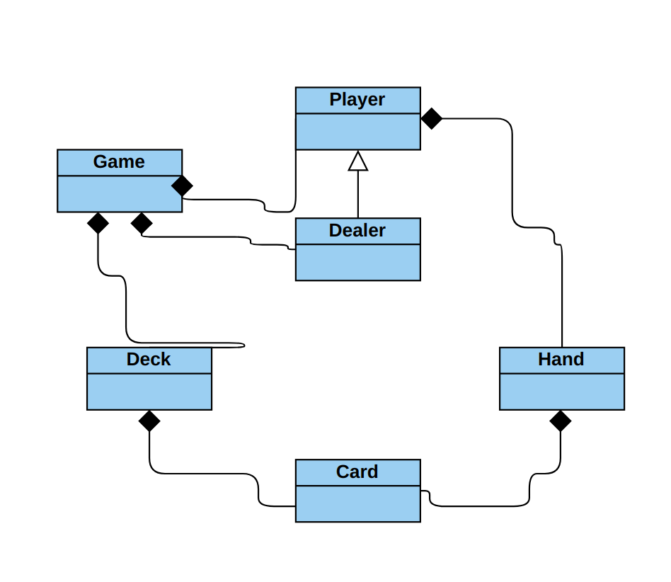
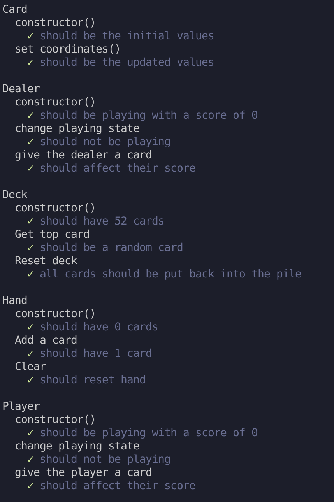

# Final Project

### I created Blackjack using the Javascript canvas.
### The Iterator and Balking design patterns were used (Decks can be accessed one element at a time, and either the player or dealer can go at a single time).
### 
 

### Here is a UML diagram that I created: 

 
 

### All test cases succesfully pass: 

